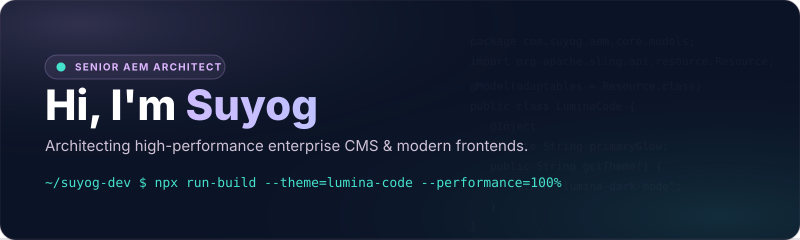

<!-- Lumina Code Profile Header -->

  
  
  

    
    
    
    
  

### 🔮 Enterprise Execution, Technical Precision.

I am an **AEM Full-Stack Architect & Developer** specialized in designing high-conversion, compliant, and decoupled content management solutions for financial leaders and global brands. I bridge the gap between heavy enterprise Java backends and sleek, accessible web applications. Explore my full work and projects at [shipsolo.xyz](https://www.shipsolo.xyz).

- **Platform Mastery**: AEM Cloud Service, AEM 6.5, OSGi modules, dispatcher configurations, and CloudFront CDN.
- **Modern Frontend**: Component-driven design utilizing React, custom Web Components, Tailwind CSS, and strict TypeScript pipelines.
- **Performance & Standard**: Driven by 100/100 Core Web Vitals optimization and WCAG 2.4.3 accessibility compliance.

---

### 🛠️ Technological Armament

A highly tailored, modern technology stack mapped to the "Lumina Code" design system:

| Layer                   | Technologies                                                                                                                                                                                                                                                                                                                                                                                                                                                                                                                                     |
| :---------------------- | :----------------------------------------------------------------------------------------------------------------------------------------------------------------------------------------------------------------------------------------------------------------------------------------------------------------------------------------------------------------------------------------------------------------------------------------------------------------------------------------------------------------------------------------------- |
| **AEM Core & CMS**      |         |
| **Backend & APIs**      |                                     |
| **Frontend Frameworks** |     |
| **Testing & CDN**       |                                                                                                                           |

---

### 📦 Featured Open Source Extensions

Developer tooling custom-built to accelerate AEM development workflows:

<table>
  <tr>
    <td width="50%">
      <h4>⚡ AEM Bulk Package Installer</h4>
      
Select multiple AEM packages (<code>.zip</code>) or OSGi bundles (<code>.jar</code>) directly from VS Code Explorer to upload, install, or backup to a local AEM server instantly.

      
    </td>
    <td width="50%">
      <h4>🛠️ AEM Tools</h4>
      
A lightweight, feature-rich editor assistant. Streamlines daily operations with native JCR synchronization, context-aware HTL validation, and helper autocompletions.

      
    </td>
  </tr>
</table>

---

### 📊 Github Engine Overview

  <table border="0">
    <tr>
      <td>
        
      </td>
      <td>
        
      </td>
    </tr>
  </table>

